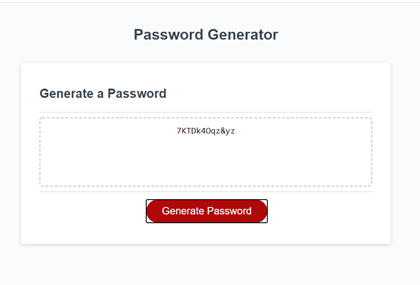

# auto-password-generator
A small tool to automatically generate passwords of specified complexity.

## Installation

This web app is made up of an Index.html file, a style.css file, and a script.js file, which controls the password generator functionality.

The location is: https://christopher-cruzcosa.github.io/auto-password-generator/ 

## Usage 

The user will initially see the password generater with placeholder text.  After hitting the "generate" button, the user will be present with a series of prompts that require the user to pick the following attributes of a password:

    1) Length - the user will be given a 'prompt' asking them to type a numeral from 8 to 128, to set the password length; passing in a numeral out of bounds or a value that is not a numeral will send an alert warning the user and then return them to the original 'prompt' until they have entered a valid response

    2) Attributes - the user will be told to select "yes/no" to four options, each with their own 'confirm', for which types of characters to make up the password; saying "no" to all four options will send an alert warning the user and then return them to the original series of 'confirms' until they have selected at least one of the options; the types of characters are:
        i.   Lower case letters of the ENG alphabet
        ii.  Upper case letters of the ENG alphabet
        iii. Special characters
        iV.  Numerals

Once the attributes have been set, the user will be alerted that the new password has been generated, and the new password will appear in the browser window, replacing the placeholder text in the password generater box. 

## Credits

Created by: Christopher Cruzcosa

## License

Copyright (c) [2020] [Christopher Cruzcosa]

Permission is hereby granted, free of charge, to any person obtaining a copy
of this software and associated documentation files (the "Software"), to deal
in the Software without restriction, including without limitation the rights
to use, copy, modify, merge, publish, distribute, sublicense, and/or sell
copies of the Software, and to permit persons to whom the Software is
furnished to do so, subject to the following conditions:

The above copyright notice and this permission notice shall be included in all
copies or substantial portions of the Software.

THE SOFTWARE IS PROVIDED "AS IS", WITHOUT WARRANTY OF ANY KIND, EXPRESS OR
IMPLIED, INCLUDING BUT NOT LIMITED TO THE WARRANTIES OF MERCHANTABILITY,
FITNESS FOR A PARTICULAR PURPOSE AND NONINFRINGEMENT. IN NO EVENT SHALL THE
AUTHORS OR COPYRIGHT HOLDERS BE LIABLE FOR ANY CLAIM, DAMAGES OR OTHER
LIABILITY, WHETHER IN AN ACTION OF CONTRACT, TORT OR OTHERWISE, ARISING FROM,
OUT OF OR IN CONNECTION WITH THE SOFTWARE OR THE USE OR OTHER DEALINGS IN THE
SOFTWARE.

